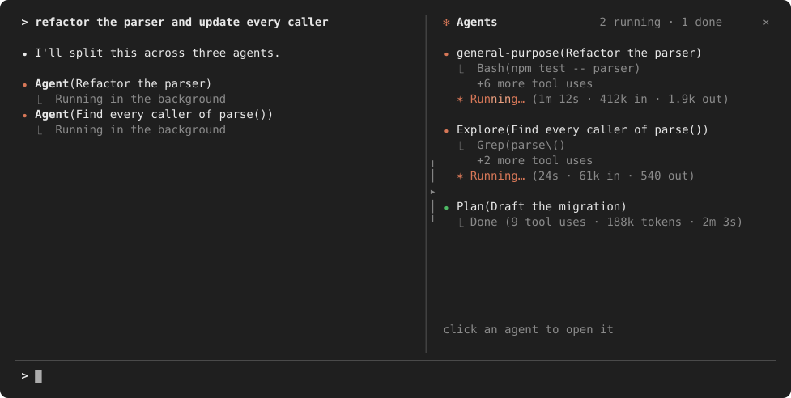
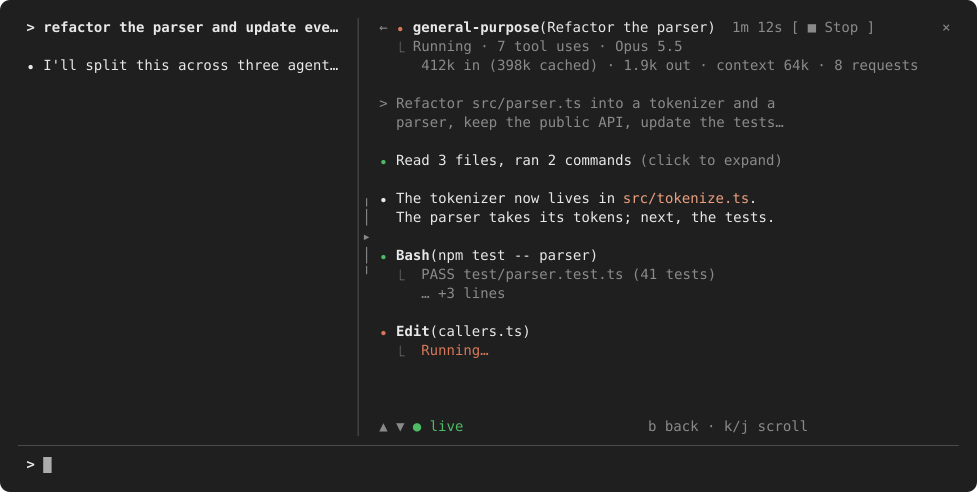
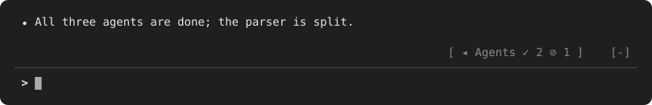

<div align="center">

# agentpane

**See your subagents at work, beside the conversation.**<br>
Every subagent a Claude Code session runs, what it is doing right now, what it costs in tokens, and its whole conversation one click away.

[](https://github.com/xuanji86/claude-agentpane/releases)
[](https://code.claude.com/docs/en/plugins/mods/overview)
[](LICENSE)
[](https://github.com/karanb192/awesome-claude-code-mods)

**English** · [中文](README.zh-CN.md)



</div>

## Why

When Claude fans work out to subagents, the terminal shows one line per agent and a footer list. **agentpane** is a
[mod](https://code.claude.com/docs/en/plugins/mods/overview) that keeps them in a side pane, drawn the way Claude
Code draws its own rows, and opens each one's conversation in place.

## Features

| | |
| --- | --- |
| **Live list** | `⏺ Type(description)`, the tool call it runs now, `+N more tool uses`, and `✶ Running… (1m 12s · Opus 5.5 · 412k in · 1.9k out)`; listed the moment it spawns |
| **Nested agents** | An agent's own subagents sit indented under it |
| **Tokens, model and effort** | Input (cached share shown), output, context size and requests per agent, from the API's own usage figures; the model and thinking effort each agent's requests actually use; `max_tokens` in red when a response was cut off |
| **Other loops** | Model loops no listed agent claims (a workflow's agents, compaction and memory forks), counted under the list |
| **Timeline** | The latest batch of agents on one time axis, a bar each: what ran side by side, and what took longest |
| **Batch receipt** | Once a batch ends: `✓ 4 agents in 31s · 1m 18s of agent time (2.5× in parallel) · 21 tool uses · 190k tokens` |
| **Status line** | `✻ 2 of 4 agents running` under the prompt while the pane is folded or closed |
| **Follows the main view** | The agent you open from Claude Code's footer list is marked `◂ main view` |
| **Conversations** | Click an agent: its brief, replies in Markdown, tool calls with their results, runs of calls folded into one line |
| **Stop** | `■ Stop`, then `Confirm stop`, ends a running agent through Claude Code's TaskStop |
| **Notices** | A toast when an agent finishes, one for several at once |
| **Opens and folds itself** | Opens when an agent starts, folds 10 s after the last one ends, to a tab above the prompt |
| **Theme colours** | Claude Code's own theme keys: follows dark, light and colourblind themes |
| **Light on redraws** | The spinner, shimmer, clocks and timeline run on the terminal's own frame clock; the pane redraws only when something changes |
| **Main screen too** | Without fullscreen, a summary of up to eight rows above the prompt instead of a side pane |

## Install

Needs **Claude Code 2.1.287 or later**, the release that brought mods (function hooks); tested on 2.1.288. The side
pane needs the fullscreen layout (`/tui fullscreen`); on the main screen agentpane is a summary above the prompt. Mods
are early access: their API may change between releases, and a release that breaks the pane gets a fix here.

```text
/plugin marketplace add xuanji86/claude-agentpane
/plugin install agentpane@claude-agentpane
```

<details>
<summary>From a terminal instead</summary>

```sh
claude plugin marketplace add xuanji86/claude-agentpane
claude plugin install agentpane@claude-agentpane
```

</details>

## Use

<table>
<tr>
<td width="60%" valign="top">

**A conversation** — click an agent



The pane widens to read it. `▲` `▼` step through it (`k` `j`), `←` goes back (`b`); scrolled back, the view holds
still while the agent writes on. Click a folded run of tool calls to open it.

</td>
<td width="40%" valign="top">

**Folded** — the `▸` handle on the pane's left edge



The pane hides and a tab above the prompt keeps the counts. Click it to bring the pane back; a new agent brings it back by itself.

</td>
</tr>
</table>

- `/agentpane` opens or closes the pane.
- `3 done` in the header hides the finished agents (their running children stay in sight).
- The pane opens by itself where Claude Code seats a pane nobody asked for: at least 144 columns (110 once you have
  opened it yourself). Below that, `/agentpane` opens it.
- The keys `b` `k` `j` work while the pane holds the keyboard: it takes it when you open a conversation (over an empty
  prompt), `Esc` gives it back.

## Configure

In `/config`, or under `pluginConfigs["agentpane"].options` in `settings.json`:

| Option | Default | Meaning |
| --- | --- | --- |
| `autoOpen` | `true` | open the pane when an agent starts |
| `foldAfter` | `10` | seconds after the last agent finishes before the pane folds; `0` keeps it open |
| `motion` | `true` | animate the spinner and shimmer; off, they stand still and the clocks still run |
| `toasts` | `true` | a toast when agents finish |
| `keepFinished` | `8` | finished agents the list keeps (1–30) |
| `statusLine` | `true` | the running agents under the prompt while the pane is not on screen |

## What it can reach

Its footprint, as the [awesome-claude-code-mods](https://github.com/karanb192/awesome-claude-code-mods) scan reads it from `claude plugin validate`:

[](https://github.com/karanb192/awesome-claude-code-mods)

agentpane watches, and acts only when you press Stop. Every hook passes its event on unchanged.

| It sees | Through |
| --- | --- |
| the session's agents and their status | `$.agent.list()`, `agent.spawn` |
| each agent's tool calls (name and a short argument) | `tool.call` |
| each agent's token usage and stop reason | `turn.step` |
| an agent's transcript, while you have it open | `$.session.messages({ agentId })` |
| which agent the main view shows | the pane's `view` |

What it draws outside its pane: the tab above the prompt, toasts, and one status line (`$.ui.status`).

It makes **no** network requests, runs no processes, reads and writes no files, stores nothing across sessions and calls
no model. Its one action is Stop: Claude Code's own `TaskStop`, on your second press, naming the agent in a cleaned,
shortened line. Text from transcripts is stripped of control, bidi and zero-width characters and cut to length before it
is drawn. `claude plugin validate .` prints exactly what it hooks and calls.

## What is inferred, not measured

- **Start times** are when the pane first saw the agent: at its spawn, or, for one already running when agentpane
  loaded, the next poll.
- **Tokens** count from when agentpane loaded; an agent that finished before then shows none.
- **Other loops** cannot tell a workflow's agent from a compaction fork: both are model loops no listed agent claims.
- **Tool counts** are the calls the pane saw, and show only for agents it watched.
- **A batch** is the agents that ran with no quiet minute between them; the timeline and the receipt cover the latest.
  Agent time is the sum of their run times, so `2.5× in parallel` is that sum over the batch's wall time.

## Limits

- **The main view stays yours.** A mod cannot switch Claude Code's main view to an agent; the footer's agent list
  (↓ then Enter) does that. agentpane shows the conversation in the pane, and marks the one the main view shows.
- **Workflow agents** have no names to list: the engine does not hand them to mods. They count under *other loops*.

## Troubleshooting

**The pane doesn't appear.** Check `claude --version` is 2.1.287 or later, run `/reload-plugins`, then `/agentpane`.
Below 144 columns Claude Code won't seat a pane nobody asked for; `/agentpane` opens it at any width. Look in the
transcript for a dim line starting `agentpane:`: it names a hook that failed or why the pane was refused. Please
[open an issue](https://github.com/xuanji86/claude-agentpane/issues) with it.

**`b` `k` `j` do nothing.** The pane needs the keyboard: click in it, or open a conversation over an empty prompt.

**Too much motion.** Set `motion` to `false` in `/config`.

## Develop

```sh
git clone https://github.com/xuanji86/claude-agentpane
cd claude-agentpane
claude plugin validate .
claude plugin test .
claude --plugin-dir .        # or add the folder to CLAUDE_CODE_PLUGIN_DIRS
```

A session that loaded the mod from its folder reloads it each time you save a file. The tests draw the pane on every
surface (terminal, desktop, VS Code, mobile) at 40–120 columns. `python3 assets/make_previews.py` redraws the README
pictures. Changes are listed in [CHANGELOG.md](CHANGELOG.md). Issues and pull requests are welcome.

## License

[MIT](LICENSE) © Anji Xu
